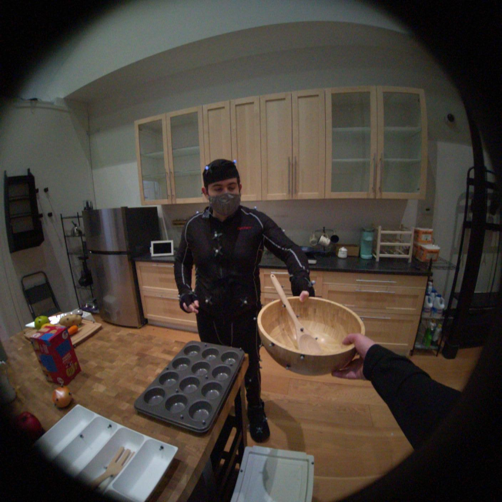
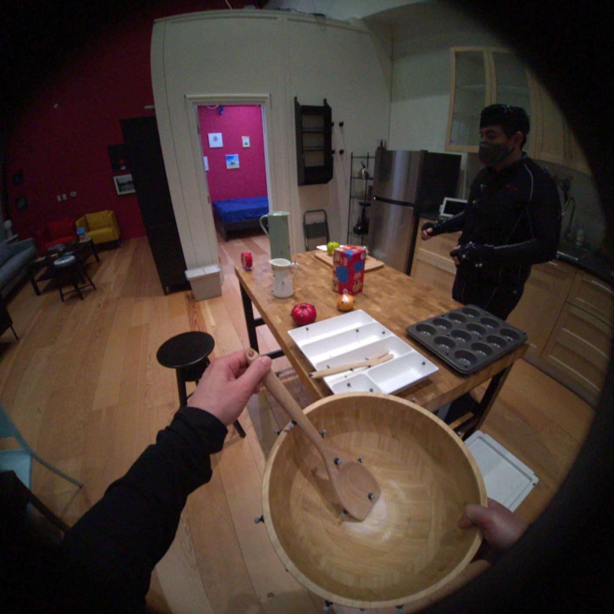

# 🎯 Multiview point cloud generation from Unik3D monocular views

This repository implements a **Unik3D → Multiview geometry** pipeline, providing the alignment of point clouds and camera poses from two monocular point cloud estimations. Below are examples using [Aria Digital Twin dataset](https://explorer.projectaria.com/adt)

## 📊 Examples

- [Apartment_release_clean_seq133_M1292](https://explorer.projectaria.com/adt/Apartment_release_clean_seq133_M1292?st=%220%22)

---

| Source images | Combined 3D point cloud, Estimated camera pose  |
|:------:|:----------:|
|   |  |

---

- [Apartment_release_multiuser_cook_seq141_M1292](https://explorer.projectaria.com/adt/Apartment_release_multiuser_cook_seq141_M1292?st=%220%22)

---

| Source images | Combined 3D point cloud, Estimated camera pose  |
|:------:|:----------:|
|   |  |

---
