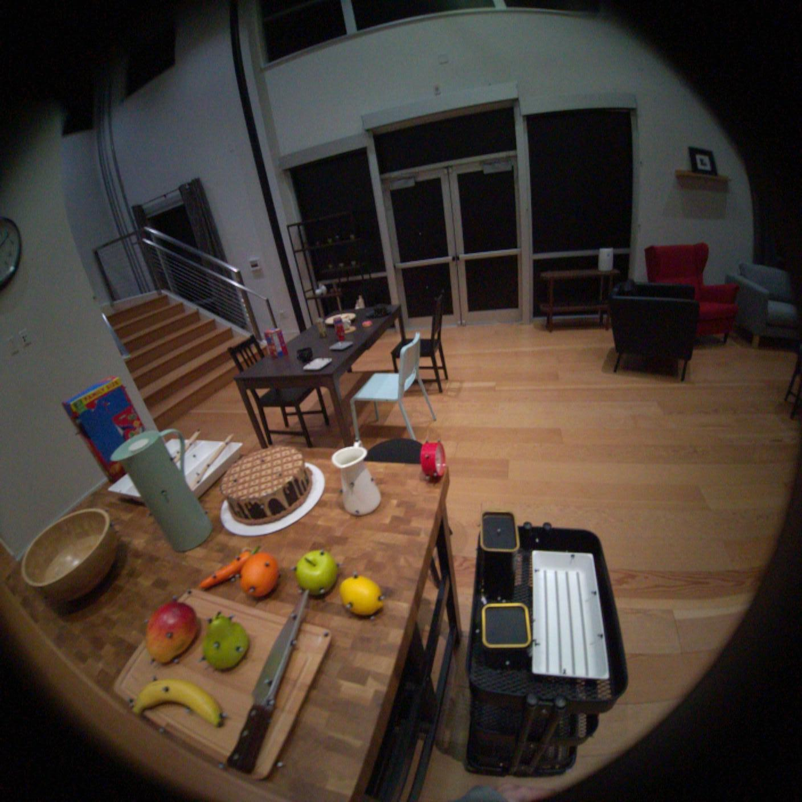
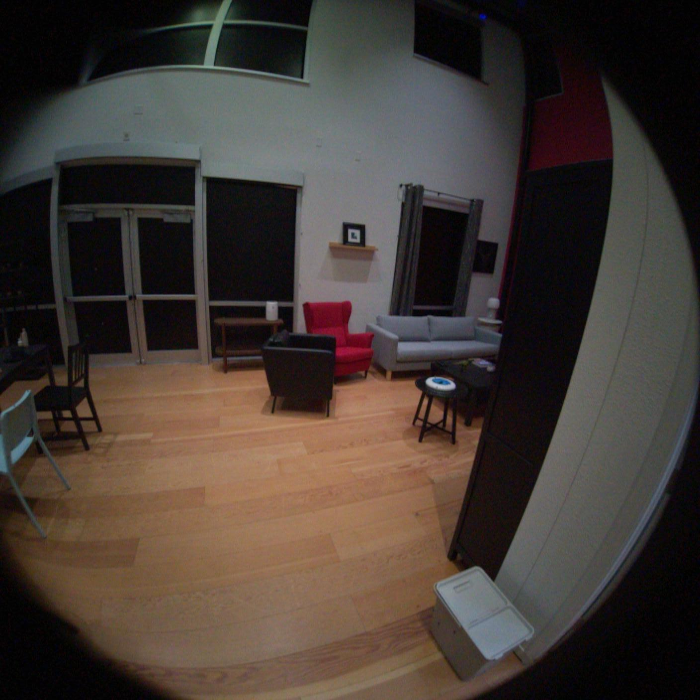

# 🎯 Multiview point cloud generation from fishyeye images using Unik3D monocular priors

This repository implements a **Unik3D → Multiview geometry** pipeline, providing the alignment of point clouds and camera poses from two monocular point cloud estimations. 

The pipeline uses inference scripts from the following repositories:

- [Unik3D](https://github.com/lpiccinelli-eth/UniK3D)
- [SuperGlue](https://github.com/magicleap/SuperGluePretrainedNetwork)

Based on the papers:

- [UniK3D: Universal Camera Monocular 3D Estimation](https://arxiv.org/abs/2503.16591)
- [SuperGlue: Learning Feature Matching with Graph Neural Networks](https://arxiv.org/abs/1911.11763)


Below is the example using [Aria Digital Twin dataset](https://explorer.projectaria.com/adt). More axamples can be found on the separate demo page

## 📊 Examples

- [Apartment_release_clean_seq133_M1292](https://explorer.projectaria.com/adt/Apartment_release_clean_seq133_M1292?st=%220%22)

---

| Source images | Combined 3D point cloud, Estimated camera pose  |
|:------:|:----------:|
| <br> |  |

---


## ⚙️ Setup, Installation & Running

### 🖥️ 1. Hardware and System Environment

This project was developed, tested, and run in the following hardware/system environment:

```
Hardware Environment

    CPU(s)        13th Gen Intel® Core™ i7-13700K x 24 
    GPU           NVIDIA GeForce RTX 4090 — 24 GB VRAM
    RAM           125 GB total
    Disk(s)       3.6 TB HDD, 1.8 TB NVMe SSD 

System Environment:
    OS            Ubuntu 22.04.5 LTS
    CUDA Toolkit  ❌ not installed 
    NVIDIA Driver 550.144.03
    Conda         version: conda 25.3.1
```

### 📦 2. Environment Setup 

#### Step 1: Dependency Installation

We use three virtual environments:
- `mvf-unik3d`: Requirements from UniK3D repository
- `superglue38`: Requirements from SuperGlue repository  
- `py11`: gsplat dependencies

Create these conda environments and install dependencies using the corresponding `requirements.txt` files.

**TODO:** Check how to merge virtual environments into one

#### Step 2: COLMAP Installation

Install COLMAP for bundle adjustment and image undistortion using conda (recommended):

```bash
# Activate the colmap_env environment
conda activate colmap_env

# Install COLMAP from conda-forge
conda install -c conda-forge colmap
```

```

Images should be in `/YOUR/SCENE_DIR/images/`. This folder should contain only the images. 
The reconstruction result (camera parameters and 3D points) will be automatically saved under `/YOUR/SCENE_DIR/sparse/` in the COLMAP format, such as:

``` 
SCENE_DIR/
├── images/
└── sparse/
    ├── cameras.bin
    ├── images.bin
    └── points3D.bin
```

The main modification is in `vggt/dependency/track_predict.py` where the query frames are changed from DINO-ranked ones to sampling with regular intervals: 
```
# Original: Find query frames
# query_frame_indexes = generate_rank_by_dino(images, query_frame_num=query_frame_num, device=device)

# New: Sample every 3rd frame
query_frame_indexes = list(range(0, len(images), 3))
```


Additionally, batched processing has been added to save memory for long sequences (200+ images):

- **Feature extraction batching** in `vggt/dependency/track_predict.py`: Processes images in batches of 50 to avoid CUDA out-of-memory errors
- **Correlation block chunking** in `vggt/dependency/track_modules/base_track_predictor.py`: Processes correlation computation in chunks of 50 frames
- **Memory management**: Automatic GPU cache clearing between batches to optimize memory usage

These modifications enable processing of long image sequences (e.g., 292 images) that would otherwise exceed GPU memory limits.


3. **Undistort images** using pinhole camera model:
```bash 
colmap image_undistorter \
    --image_path "$IMAGE_DIR" \
    --input_path "$IMAGE_DIR/sparse" \
    --output_path "$UNDISTORTED_COLMAP_OUTPUT" \
    --output_type COLMAP \
    --max_image_size 2000
```

CUDA_VISIBLE_DEVICES=0 python simple_trainer.py default \
    --data_dir "${REMOTE_IMAGE_DIR}_undistorted" \
    --data_factor 1 \
    --result_dir "$WORKDIR/../gsplat/examples/results/$GSPLAT_OUTPUT_DIR" \
    --save_ply \
    --ply_steps 30000 \
    --disable_viewer \
    --render_traj_path "ellipse"
```


### 🚀 Running Pipelines 

The simplest way to run the pipeline is on a remote machine through SSH connection using the scripts:

**Run the pipeline to get sparse model from VGGT-Long:**
```bash
./src_vggt_colmap/run_pipeline_vggt_long_colmap.sh
```

**Run the pipeline to get sparse model from COLMAP:**
```bash
./src_vggt_colmap/run_pipeline_vggt_long_colmap.sh
```

**Download results:**
```bash
./src_vggt_colmap/download_results_vggt_colmap.sh
./src_vggt_colmap/download_results_colmap.sh
```

**Parsing log files to collect metrics:**
```bash
./src_metrics/collect_metrics.sh
```
